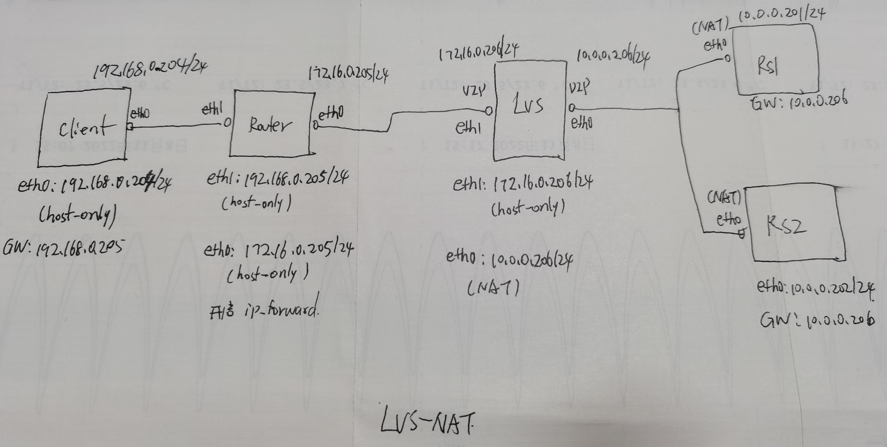
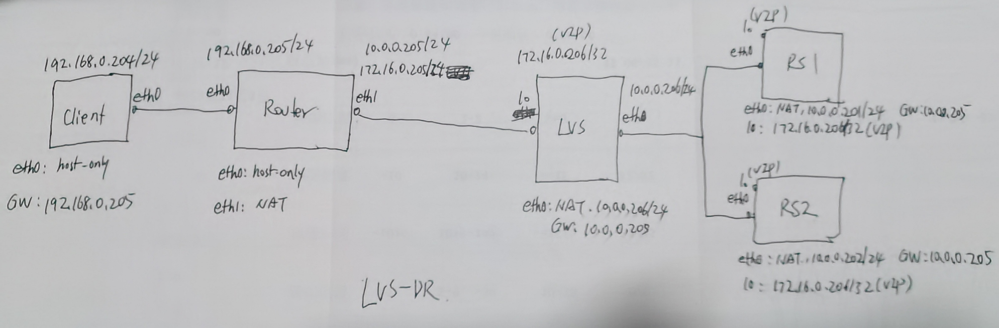

开源负载均衡器 Linux Virtual Server


# 资源
> 维基百科介绍：[Linux Virtual Server](https://en.wikipedia.org/wiki/Linux_Virtual_Server)
> 红帽介绍文档：[Virtual Server Administration](https://access.redhat.com/documentation/en-us/red_hat_enterprise_linux/4/html/virtual_server_administration/index)
> [5. LVS-NAT](https://docs.huihoo.com/hpc-cluster/linux-virtual-server/HOWTO/LVS-HOWTO.LVS-NAT.html)
> [The Linux Enterprise Cluster: Build a Highly Available Cluster with Commodity Hardware and Free Software](https://books.google.co.jp/books?id=wiCGoCq8n4oC&pg=PA196&lpg=PA196&dq=LVS-NAT&source=bl&ots=NsZuExpQ3q&sig=ACfU3U2oy5ADOp1o8KTUTiiXlELmxqlfSQ&hl=zh-CN&sa=X&ved=2ahUKEwjo-cbF1vj-AhW6gVYBHd-uDgMQ6AF6BAgYEAM#v=onepage&q=LVS-NAT&f=false)


# LVS 介绍
LVS（Linux Virtual Server）是一个在Linux操作系统上运行的负载均衡软件系统，它能够将来自客户端的请求分配到多个后端服务器上，以实现高可靠性的服务提供。

LVS包含了多个负载均衡服务模块，其中最常用的是IP负载均衡模块。
该模块使用Linux内核提供的IP负载均衡机制来实现控制数据包转发和请求调度，因此LVS系统具有良好的可扩展性和高性能。

- LVS 是集成在 Linux 内核中的功能
- LVS 实现的是 IP-level 负载均衡
- 包含多个模块，有很好的扩展性
- load balancer 将客户端的请求通过调度算法调度到后端的多个服务器上，实现负载均衡
- 客户并不知道到自己真正使用的是哪个后端服务器，多个后端服务器构成的集群对外就像一个高性能的服务器
- load balancer 和后端的服务器（real server）之间的通讯可以是 high-speed LAN 或 WAN

## 什么是 virtual server
> [Linux Virtual Server](http://www.linuxvirtualserver.org/whatis.html)

> Build a high-performance and highly available server for Linux using clustering technology, 
> which provides good scalability, reliability and serviceability.


## 为什么需要 virtual server
> [Why virtual server?](http://www.linuxvirtualserver.org/why.html)

> The workload on the servers is increasing rapidly so that servers will be easily overloaded for a short time, especially for a popular web site. 

- 单个服务器很难应对越来越多的客户端请求，服务器超负荷工作
- 有两种解决方案：增加服务器的性能，集群方案
- 增加单个服务器的性能始终有个极限，每次升级系统后当过载后又要升级，复杂且代价大
- 集群的方案可扩展性好，且高效


# LVS 集群类型术语
- VS
virtual server

- DS
director server
dispacher
load balancer

- RS
real server

- CIP 
client IP
客户端 IP

- VIP
virtual server IP
VS 对外 IP

- DIP
director IP
VS 内网 IP 

- RIP
real server IP
后端服务器的 IP


# LVS 和 IPVS
LVS (Linux Virtual Server) and IPVS (IP Virtual Server) are closely related technologies for building high-performance and high-availability load balancers in Linux environments. 

In fact, IPVS is a component of LVS.

To be more specific, LVS is a load-balancing solution that includes both a kernel component (IPVS) and a user-space component (lvsd daemon). 
IPVS provides Layer 4 load balancing for TCP/UDP traffic using a range of scheduling algorithms, such as round-robin, least-connection, weighted-round-robin, and more. It allows multiple backend real servers to be grouped into a single virtual service IP address, and it can handle millions of concurrent connections with low latency and high throughput.

LVS, on the other hand, provides a comprehensive load-balancing framework that includes not only IPVS but also other components such as the lvsd daemon, which can manage the virtual IP addresses, perform health checks on the backend servers, and detect and handle node failures. LVS also supports several load-balancing methods, including IPVS (layer 4), NAT (layer 3), and Tunneling (layer 2). 
Additionally, LVS can be configured for service persistence, failover, and synchronization across multiple nodes.

while IPVS and LVS are related, LVS is not the same as IPVS - rather, IPVS is one of the components of LVS that provides layer 4 load balancing. LVS is a larger and more comprehensive load-balancing solution that includes IPVS and other components, and provides more advanced features and configuration options.


- IPVS 是 LVS 的一部分

# IPVS 内核模块
> [IPVS](http://www.linuxvirtualserver.org/software/ipvs.html)

IPVS stands for IP Virtual Server. It is a kernel module in the Linux operating system that provides Layer 4 load balancing in a hierarchical and scalable manner. IPVS is commonly used with other Linux kernel modules to set up a high-performance and high-availability load balancer for TCP and UDP services.

IPVS provides a virtual service that has a virtual IP address (VIP) and listens to a specific port number. 
When a client connects to the virtual service, IPVS selects one of the real servers (i.e., physical servers) that are part of the IPVS cluster and forwards the traffic to that server. IPVS uses various load-balancing algorithms to select a real server, such as round-robin, weighted round-robin, least-connection, source-dest-IP hash, and more.

IPVS also provides an NAT engine that can be used to maintain the source address of clients connecting to the IPVS cluster. This NAT mode allows the connection to be served by a server even if it doesn't have the VIP configured as its own IP address.

Overall, IPVS provides a flexible and fast load-balancing solution that is suitable for a wide range of applications. It's commonly used in Linux-based load balancers such as LVS (Linux Virtual Server) and HAProxy.


- IPVS 说 linux 的一个内核模块
- IPVS 提供 layer 4 load balancing


## 查看内核中 IPVS 模块
模糊搜索 IPVS 的关键字
先确定内核版本，然后在 `/boot/cinfig-`文件中搜索关键字

```bash
[root@ubuntu22-c3 ~]$ uname -r
5.15.0-73-generic
[root@ubuntu22-c3 ~]$ grep -i -C 10 "ipvs" /boot/config-5.15.0-73-generic
```

看到其中包含如下内容：
```bash
CONFIG_IP_VS=m

#
# IPVS transport protocol load balancing support
#
CONFIG_IP_VS_PROTO_TCP=y
CONFIG_IP_VS_PROTO_UDP=y
CONFIG_IP_VS_PROTO_AH_ESP=y
CONFIG_IP_VS_PROTO_ESP=y
CONFIG_IP_VS_PROTO_AH=y
CONFIG_IP_VS_PROTO_SCTP=y

#
# IPVS scheduler
#
CONFIG_IP_VS_RR=m
CONFIG_IP_VS_WRR=m
CONFIG_IP_VS_LC=m
CONFIG_IP_VS_WLC=m
CONFIG_IP_VS_FO=m
CONFIG_IP_VS_OVF=m
CONFIG_IP_VS_LBLC=m
CONFIG_IP_VS_LBLCR=m
CONFIG_IP_VS_DH=m
CONFIG_IP_VS_SH=m
CONFIG_IP_VS_MH=m
CONFIG_IP_VS_SED=m
CONFIG_IP_VS_NQ=m
CONFIG_IP_VS_TWOS=m

#
# IPVS SH scheduler
#
CONFIG_IP_VS_SH_TAB_BITS=8

#
# IPVS MH scheduler
#
CONFIG_IP_VS_MH_TAB_INDEX=12

#
# IPVS application helper
#
CONFIG_IP_VS_FTP=m
CONFIG_IP_VS_NFCT=y
CONFIG_IP_VS_PE_SIP=m
```
模块关键字为 `IP_VS`，看到 `=m` 表示是以模块方式加载
里面包含 `IPVS transport protocol load balancing support` 四层负载均衡模块
各种调度算法模块

## 查看 IPVS 模块是否已加载
```bash
[root@ubuntu22-c3 ~]$ lsmod | grep -i "ip_vs"
```

没有输出表示该模块当前未加载

## 查看 IPVS 模块的信息
`modinfo` 查看模块信息，即使当前未加载，但在内核中也能显示，部分内容如下：
```bash
[root@ubuntu22-c3 ~]$ modinfo ip_vs
filename:       /lib/modules/5.15.0-73-generic/kernel/net/netfilter/ipvs/ip_vs.ko
license:        GPL
srcversion:     4FE3506EF25C79B61C3BA97
depends:        nf_conntrack,nf_defrag_ipv6,libcrc32c
retpoline:      Y
intree:         Y
name:           ip_vs
vermagic:       5.15.0-73-generic SMP mod_unload modversions
sig_id:         PKCS#7
signer:         Build time autogenerated kernel key
sig_key:        57:61:37:71:BE:F4:68:C5:BD:86:42:AF:17:E2:D7:9A:0A:B2:05:50
sig_hashalgo:   sha512
signature:      9B:F6:D0:92:74:55:52:81:3E:F6:09:E5:F2:71:CD:67:75:93:B0:DD:
```

# ipvsadm LVS 命令行工具
- ipvs 是内核模块，需要在用户空间的工具 ipvsadm 来管理
- 默认未安装该功能，需要手动安装 
- ipvsadm 会监听维护和监听内核中的 virtual server table

```bash
[root@ubuntu22-c3 ~]$ sudo apt install -y ipvsadm
```

查看帮助文档
```bash
ipvsadm - Linux Virtual Server administration
Ipvsadm(8)  is used to set up, maintain or inspect the virtual server table in the Linux kernel.
```

查看服务的状态：
```bash
[root@ubuntu22-c3 ~]$ systemctl status ipvsadm.service
● ipvsadm.service - LSB: ipvsadm daemon
     Loaded: loaded (/etc/init.d/ipvsadm; generated)
     Active: active (exited) since Thu 2023-06-08 16:25:20 CST; 13s ago
       Docs: man:systemd-sysv-generator(8)
    Process: 19552 ExecStart=/etc/init.d/ipvsadm start (code=exited, status=0/SUCCESS)
        CPU: 7ms

Jun 08 16:25:20 ubuntu22-c3 systemd[1]: Starting LSB: ipvsadm daemon...
Jun 08 16:25:20 ubuntu22-c3 ipvsadm[19552]:  * ipvsadm is not configured to run. Please edit /etc/default/ipvsadm
Jun 08 16:25:20 ubuntu22-c3 systemd[1]: Started LSB: ipvsadm daemon.
```

该服务的状态为 `active (exited)` 而非 `active (running)`，表示该服务并非长期运行，执行完成功后即退出
该服务不是 long-running server，而是按需启动

The service is not currently running, but it did run and complete its task without any errors.

In the case of `ipvsadm.service`, this service is a Systemd unit file that provides a command-line interface for configuring IPVS (IP Virtual Server) kernel module. 
When you start this service, it runs the `ipvsadm` command with the appropriate options and generates the necessary IPVS configuration rules in the kernel. 
Once the `ipvsadm` command completes its task, the service exits with a status code of 0, indicating that it completed successfully.

Therefore, it's normal to see the "Active: active (exited)" status for `ipvsadm.service` since it's not a long-running service but rather a utility that is executed on demand to configure the kernel's IP load-balancing rules.


可以看到服务的启动脚本为 `/etc/init.d/ipvsadm`

## ipvsadm -L|l 查看 ipvs 规则

加上 `-n` 以数字形式输出地址和端口号
```bash
[root@lvs-1 ~]$ ipvsadm -Ln
IP Virtual Server version 1.2.1 (size=4096)
Prot LocalAddress:Port Scheduler Flags
  -> RemoteAddress:Port           Forward Weight ActiveConn InActConn
TCP  172.16.0.206:80 wrr
  -> 10.0.0.201:80                Masq    1      0          0
  -> 10.0.0.202:80                Masq    1      0          0
FWM  100 wrr persistent 50
```

## ipvsadm -A 添加虚拟服务器
```bash
ipvsadm -A|E virtual-service [-s scheduler] [-p [timeout]] [-M netmask] 
```

```bash
[root@lvs-1 ~]$ ipvsadm -A -t 172.16.0.206:80 -s wrr
```

虚拟服务器格式：
```bash
virtual-service:
  --tcp-service|-t  service-address   service-address is host[:port]
  --udp-service|-u  service-address   service-address is host[:port]
  --sctp-service    service-address   service-address is host[:port]
  --fwmark-service|-f fwmark          fwmark is an integer greater than zero
```

集群调度器支持的算法：
```bash
--scheduler  -s scheduler   one of rr|wrr|lc|wlc|lblc|lblcr|dh|sh|sed|nq|fo|ovf|mh,
                            the default scheduler is wlc.
```

## ipvsadm -a 添加后端服务器
```bash
ipvsadm -a|e virtual-service -r server-address [options]
```

```bash
[root@lvs-1 ~]$ ipvsadm -a -t 172.16.0.206:80 -r 10.0.0.201:80 -m
[root@lvs-1 ~]$ ipvsadm -a -t 172.16.0.206:80 -r 10.0.0.202:80 -m
[root@lvs-1 ~]$ ipvsadm -Ln
IP Virtual Server version 1.2.1 (size=4096)
Prot LocalAddress:Port Scheduler Flags
  -> RemoteAddress:Port           Forward Weight ActiveConn InActConn
TCP  172.16.0.206:80 wrr
  -> 10.0.0.201:80                Masq    1      0          0
  -> 10.0.0.202:80                Masq    1      0          0
FWM  100 wrr persistent 50
```

选项：
```bash
--gatewaying   -g   gatewaying (direct routing) (default)
--ipip         -i   ipip encapsulation (tunneling)
--masquerading -m   masquerading (NAT)  
--weight       -w weight  capacity of real server # 权重
```

## ipvsadm -e 修改规则
之前的规则：
```bash
[root@lvs-1 ~]$ ipvsadm -Ln
IP Virtual Server version 1.2.1 (size=4096)
Prot LocalAddress:Port Scheduler Flags
  -> RemoteAddress:Port           Forward Weight ActiveConn InActConn
TCP  172.16.0.206:80 wrr
  -> 10.0.0.201:80                Masq    1      0          0
  -> 10.0.0.202:80                Masq    1      0          0
FWM  100 wrr persistent 50
```

修改类型
```bash
[root@lvs-1 ~]$ ipvsadm -e -t 172.16.0.206:80 -r 10.0.0.201:80 -g
[root@lvs-1 ~]$ ipvsadm -e -t 172.16.0.206:80 -r 10.0.0.202:80 -g
[root@lvs-1 ~]$ ipvsadm -Ln
IP Virtual Server version 1.2.1 (size=4096)
Prot LocalAddress:Port Scheduler Flags
  -> RemoteAddress:Port           Forward Weight ActiveConn InActConn
TCP  172.16.0.206:80 wrr
  -> 10.0.0.201:80                Route   1      0          0
  -> 10.0.0.202:80                Route   1      0          0
FWM  100 wrr persistent 50
```

## ipvsadm -d 删除规则

## ipvsadm -C 清空规则
```bash
[root@lvs-1 ~]$ ipvsadm -Ln
IP Virtual Server version 1.2.1 (size=4096)
Prot LocalAddress:Port Scheduler Flags
  -> RemoteAddress:Port           Forward Weight ActiveConn InActConn
TCP  172.16.0.206:80 wrr
  -> 10.0.0.201:80                Route   1      0          0
  -> 10.0.0.202:80                Route   1      0          0
FWM  100 wrr persistent 50
[root@lvs-1 ~]$ ipvsadm -C
[root@lvs-1 ~]$ ipvsadm -Ln
IP Virtual Server version 1.2.1 (size=4096)
Prot LocalAddress:Port Scheduler Flags
  -> RemoteAddress:Port           Forward Weight ActiveConn InActConn
```

## ipvsadm -S 保存规则
相当于 ipvsadm-save

## ipvsadm -R 重载规则
相当于 ipvsadm-restore

## 永久保存 ipvs 规则并开启自动加载

### ubuntu22.04
默认保存到 `/etc/ipvsadm.rules` 文件中

```bash
[root@lvs-1 ~]$ service ipvsadm save
 * Saving IPVS configuration...                                                                             [ OK ]
[root@lvs-1 ~]$ cat /etc/ipvsadm.rules
# ipvsadm.rules
-A -t 172.16.0.206:80 -s wrr
-a -t 172.16.0.206:80 -r 10.0.0.201:80 -m -w 1
-a -t 172.16.0.206:80 -r 10.0.0.202:80 -m -w 1
```

开机自动加载：
修改 `/etc/default/ipvsadm` 文件，将下面 `AUTO` 的值设置为 `true`
```bash
# ipvsadm

# if you want to start ipvsadm on boot set this to true
AUTO="true"
```

### rocky8
保存规则
```bash
[root@rocky8 ~]# ipvsadm-save -n > /etc/sysconfig/ipvsadm
```

开机自启
```bash
[root@rocky8 ~]# systemctl enable ipvsadm.service
```

# LVS 实现的三种方式
> [How virtual server works?](http://www.linuxvirtualserver.org/how.html)

- 四层负载实现

## LVS-NAT
> [Virtual Server via NAT](http://www.linuxvirtualserver.org/VS-NAT.html)

这里的描述基于官网图中的基本框架，VS 是单点，实际可能 VS 也要做负载均衡，前面有个 load balancer 来做负载均衡

- 客户端的请求的报文中目标 IP 是对外的虚拟服务器（VS）的对外 IP（VIP）
- VS 收到请求报文后，根据调度算法选择一个后端服务器来处理客户端的请求
- VS 将请求报文中的目标 IP 地址和端口改为选择的后端服务器的 IP 和端口，做 DNAT 转换
- VS 将该记录写入一个 Hash 表中，以后有该客户端的请求到达时，转发到 Hash 表中记录的后端服务器上
- 后端服务器处理了请求后将报文发给 VS，此时的报文源 IP 和 端口为 RIP 和后端服务器的处理端口，目标 IP 为 CIP；因此 VS 将源 IP 和端口改回自己的 VIP 和客户端请求时的端口，发回给客户端，做 SNAT 转换 

搭建框架：
- RIP和DIP应在同一个网络，且应使用私网地址；RS的网关要指向DIP
- 请求报文和响应报文都必须经由Director转发，因此 Director易于成为系统瓶颈
- 可修改请求报文的目标端口
- LVS 需要开启 ip_forward

## LVS-DR
> [7. LVS-DR](https://docs.huihoo.com/hpc-cluster/linux-virtual-server/HOWTO/LVS-HOWTO.LVS-DR.html)

Direct Routing，直接路由，LVS默认模式，应用最广泛，通过为请求报文重新封装一个MAC首部进行转发，源MAC是DIP所在的接口的MAC，目标MAC是某挑选出的RS的RIP所在接口的MAC地址；源 IP/PORT，以及目标IP/PORT均保持不变

- Director 和后端服务器 RS 都配置有 VIP
- 客户端请求时的目标 IP 为 VIP，要保证请求报文发送到 Director
需要解决地址冲突
- Director 收到客户端的请求报文后，修改报文中的目标 MAC 地址为调度器筛选出来的某个后端服务器 RS 的 MAC 地址，源 IP/PORT，以及目标IP/PORT均保持不变
不支持端口映射，不能修改请求报文的端口
- RS 出来请求后直接相应客户端，不再经过 Director 处理
RIP 的网关不指向 DIP

搭建框架：
- RIP 和 DIP 处于一个网络
- RIP 的网关不指向 DIP
- LVS 不用开启 ip_forward
- 确保前端路由器将目标 IP 为 VIP 的请求报文发送到 Director 而非后端服务器

### 地址冲突的解决方案
> [Linux 内核参数 arp_ignore & arp_announce 详解](https://www.cnblogs.com/hyl8218/p/9050836.html)

客户端请求时的目标 IP 为 VIP，后端所有服务器都配有 VIP，要保证请求报文发送到 Director

1. 前端网关静态绑定 VIP 和 Director 的 MAC 的地址
2. 后端各 RS 上用 arptables 工具来限制 arp 响应
3. 后端各 RS 上修改内核参数来限制 arp 响应和通告级别
- arp_ignore 限制响应级别
这个参数用于控制内核对于接收到的 ARP 请求的响应行为。
   - 0：不进行忽略，根据系统配置的规则来响应ARP请求。默认值
   - 1：只有当目标IP地址在本地子网上时，才会响应ARP请求。
   - 2：无条件地忽略ARP请求，不会响应任何ARP请求。

选择模式 1

- arp_announce 限制通告级别
这个参数用于控制内核发送 ARP 响应时的源 IP 地址选择。
   - 0（默认值）：将本机所有接口的所有信息向每个接口的网络进行通告。
   - 1：尽量避免将接口信息向非直接连接的网络进行通告。
   - 2：必须避免将接口信息向非本网络进行通告。

这里选择模式 2

## LVS-TUN
在请求的原 IP 报文之外再封装一个IP首部，新IP首部的源IP为 DIP，目标IP为RIP，然后将该报文发送给筛选的RS，RS处理请求后直接响应给客户端

- RIP 和 DIP 可以不在一个网络中
- RS 的网关一般不能指向 DIP
- RIP 能和公网通信，因为 RS 直接响应客户端
- RS 和 LVS 要开启 tunnel 网卡
ubuntu22.04 中默认有一个 tunl0 网卡
```bash
[root@rs1 html]$ ip link show tunl0
3: tunl0@NONE: <NOARP> mtu 1480 qdisc noop state DOWN mode DEFAULT group default qlen 1000
    link/ipip 0.0.0.0 brd 0.0.0.0
```
可以在该网卡上绑定 VIP 
```bash
[root@rs1 html]$ ip addr add 172.16.0.206/32 dev tunl0
```

## LVS-FULLNAT
同时修改请求报文的源IP和目标IP地址，源IP修改为DIP，目标IP修改为RIP
相对于 NAT模式，RIP 和 DIP可以不在一个网段，只要能通信
该模式内核默认不支持

# LVS 调度算法

## 静态调度算法

### 轮询 RR

### 加权轮询 WRR

### 源地址哈希算法 SH
将来自同一个 IP 地址的请求发送给同一个 RS，实现会话绑定

### 目标地址哈希 DH
同一个目标地址的请求发送给相同的 RS


## 动态调度算法
### 最少连接算法 LC
least connections，适用于长连接应用

### 加权最少连接算法 WLC
weighted LC，默认的调度算法

### 最短期望延迟算法 SED
shorted expection delay

### 最少队列算法 NQ
never queue

### 基于局部的最少连接算法LBLC
Locality-Based LC

### 带复制的基于局部的最少连接算法LBLCR
LBLC with Replication

### FO
weighted fail over

### OVF
overflow-connection

# LVS-NAT 实验
> [Virtual Server via NAT](http://www.linuxvirtualserver.org/VS-NAT.html)

实验环境：ubuntu22.04 



## client
eth0: host only, 192.168.0.204/24
模仿互联网客户端，可通过路由器和 LVS 的 VIP 相连，不能访问 LVS 后端服务器

### 修改网卡配置
```bash
# This file describes the network interfaces available on your system
# For more information, see netplan(5).
network:
  version: 2
 #renderer: networkd
  renderer: NetworkManager
  ethernets:
    eth0:
      match:
        name: eth0
      addresses: 
      - 192.168.0.204/24
      routes:
      - to: default
        via: 192.168.0.205
      - to: 172.16.0.0/24
        via: 172.16.0.205
      nameservers:
         addresses: [192.168.0.205]
```

默认网关为 192.168.0.205

可以 ping 通 LVS 的 VIP 地址 172.16.0.206

### 测试
用 curl 命令获取测试文档 test.html 的内容，写 vip 172.16.0.206 的地址

```bash
while :; do curl 172.16.0.206/test.html; sleep 0.5; done
```

可以看见 LVS 轮流将请求调度到后端的两个服务器上

## router
eth0 host-only 172.16.0.205/24
eth1 host-only 192.168.0.205/24

### 开启 ip_forward
查看 ip_forward
```bash
[root@router ~]$ /home/lx/shell_scripts# sysctl -n net.ipv4.ip_forward
0
```
编辑 /etc/sysctl.conf 文件将下面行取消注释
```bash
# Uncomment the next line to enable packet forwarding for IPv4
#net.ipv4.ip_forward=1
```

使配置文件生效：
```bash
[root@router ~]$ /home/lx/shell_scripts# sysctl -p
net.ipv4.ip_forward = 1
```

### 修改网卡配置文件
```bash
# This file describes the network interfaces available on your system
# For more information, see netplan(5).
network:
  version: 2
 #renderer: networkd
  renderer: NetworkManager
  ethernets:
    eth0:
      match:
        name: eth0
      addresses: 
      - 172.16.0.205/24
    eth1:
      match:
        name: eth1
      addresses: 
      - 192.168.0.205/24
```


## LVS
eth0 NAT 10.0.0.206/24
eth1 host-only 172.16.0.206/24

### 开启 ip_forward

### 修改网卡配置文件
```bash
# This file describes the network interfaces available on your system
# For more information, see netplan(5).
network:
  version: 2
 #renderer: networkd
  renderer: NetworkManager
  ethernets:
    eth0:
      match:
        name: eth0
      addresses: 
      - 10.0.0.206/24
      routes:
      - to: default
        via: 10.0.0.2
      nameservers:
         addresses: [10.0.0.2]
    eth1:
      match:
        name: eth1
      addresses: 
      - 172.16.0.206/24
      routes:
      - to: 192.168.0.0/24
        via: 192.168.0.205
```

路由条目：
```bash
[root@lvs-1 ~]$ route -n
Kernel IP routing table
Destination     Gateway         Genmask         Flags Metric Ref    Use Iface
0.0.0.0         10.0.0.2        0.0.0.0         UG    100    0        0 eth0
10.0.0.0        0.0.0.0         255.255.255.0   U     100    0        0 eth0
172.16.0.0      0.0.0.0         255.255.255.0   U     101    0        0 eth1
192.168.0.0     192.168.0.205   255.255.255.0   UG    101    0        0 eth1
192.168.0.205   0.0.0.0         255.255.255.255 UH    101    0        0 eth1
```

ping client：
```bash
[root@lvs-1 ~]$ ping -c3 192.168.0.204
PING 192.168.0.204 (192.168.0.204) 56(84) bytes of data.
64 bytes from 192.168.0.204: icmp_seq=1 ttl=63 time=1.13 ms
64 bytes from 192.168.0.204: icmp_seq=2 ttl=63 time=1.86 ms
64 bytes from 192.168.0.204: icmp_seq=3 ttl=63 time=1.54 ms
```

### 安装 ipvsadm
```bash
apt update && apt install -y ipvsadm
```

### 配置 ipvs 规则
先 通过 ipvsadm 工具配置规则，临时生效
```bash
[root@lvs-1 ~]$ ipvsadm -A -t 172.16.0.206:80 -s wrr
[root@lvs-1 ~]$ ipvsadm -a -t 172.16.0.206:80 -r 10.0.0.201:80 -m
[root@lvs-1 ~]$ ipvsadm -a -t 172.16.0.206:80 -r 10.0.0.202:80 -m
[root@lvs-1 ~]$ ipvsadm -Ln
IP Virtual Server version 1.2.1 (size=4096)
Prot LocalAddress:Port Scheduler Flags
  -> RemoteAddress:Port           Forward Weight ActiveConn InActConn
TCP  172.16.0.206:80 wrr
  -> 10.0.0.201:80                Masq    1      0          0
  -> 10.0.0.202:80                Masq    1      0          0
FWM  100 wrr persistent 50
```

客户端测试通过后，将规则永久保存：
```bash
[root@lvs-1 ~]$ service ipvsadm save
 * Saving IPVS configuration...                                                                             [ OK ]
[root@lvs-1 ~]$ cat /etc/ipvsadm.rules
# ipvsadm.rules
-A -t 172.16.0.206:80 -s wrr
-a -t 172.16.0.206:80 -r 10.0.0.201:80 -m -w 1
-a -t 172.16.0.206:80 -r 10.0.0.202:80 -m -w 1
```

## RS1
eth0: NAT 10.0.0.201/24

后端服务器要联网安装 nginx 测试用，因此用 NAT 模式

### 修改网卡配置文件
```bash
# This file describes the network interfaces available on your system
# For more information, see netplan(5).
network:
  version: 2
 #renderer: networkd
  renderer: NetworkManager
  ethernets:
    eth0:
      match:
        name: eth0
      addresses: 
      - 10.0.0.201/24
      routes:
      - to: default
        via: 10.0.0.206
      nameservers:
         addresses: [10.0.0.2]
```

### 安装 nginx
测试用，直接包安装，然后添加测试文件
```bash
apt update && apt install -y nginx
```

添加测试文件 /var/www/html/test.html
```bash
[root@rs1 html]$ cat <<EOF > /var/www/html/test.html
> rs1 10.0.0.201
> EOF
```

## RS2
eth0: NAT 10.0.0.202/24

安装 nginx，添加测试文件
```bash
[root@rs2 ~]$ cat <<EOF > /var/www/html/test.html
> rs2 10.0.0.202
> EOF
```


# LVS_DR
- 后端 RS 增加一个网卡用于绑定 VIP
也可以用 lo 网卡附加 VIP 地址，这种方式则 VIP 的子网掩码必须为 32 位

本实验用 lo 网卡绑定 VIP，用命令附加 IP 地址，如果需要每次开机生效，可以写到一个启动脚本 `/etc/rc.local` 中

- 实验环境在 LVS_NAT 基础上修改



## client
不变
eth0: host only, 192.168.0.204/24

## router
依旧开启 ip_forward

eth0: host-only, 192.168.0.205/24
eth1: NAT, 10.0.0.205/24 172.16.0.206/24 配置两个 IP 地址

### 修改网卡配置文件
```bash
# This file describes the network interfaces available on your system
# For more information, see netplan(5).
network:
  version: 2
 #renderer: networkd
  renderer: NetworkManager
  ethernets:
    eth0:
      match:
        name: eth0
      addresses: 
      - 192.168.0.205/24
    eth1:
      match:
        name: eth1
      addresses: 
      - 10.0.0.205/24
      - 172.16.0.205/24
      routes:
      - to: default
        via: 10.0.0.2
      nameservers:
        addresses: [10.0.0.2]
```


## LVS
可以关闭 ip_forward
可以只用一个网卡，网关指向路由器的一个接口
eth0: NAT, 10.0.0.206/24, GW: 10.0.0.205 (router)
lo: 附加一个 VIP 172.16.0.206/32


### 修改网卡配置文件
```bash
# This file describes the network interfaces available on your system
# For more information, see netplan(5).
network:
  version: 2
 #renderer: networkd
  renderer: NetworkManager
  ethernets:
    eth0:
      match:
        name: eth0
      addresses: 
      - 10.0.0.206/24
      routes:
      - to: default
        via: 10.0.0.205
      nameservers:
         addresses: [10.0.0.2]
```

### 修改 ipvs 规则
之前的规则：
```bash
[root@lvs-1 ~]$ ipvsadm -Ln
IP Virtual Server version 1.2.1 (size=4096)
Prot LocalAddress:Port Scheduler Flags
  -> RemoteAddress:Port           Forward Weight ActiveConn InActConn
TCP  172.16.0.206:80 wrr
  -> 10.0.0.201:80                Masq    1      0          0
  -> 10.0.0.202:80                Masq    1      0          0
FWM  100 wrr persistent 50
```

修改类型
```bash
[root@lvs-1 ~]$ ipvsadm -e -t 172.16.0.206:80 -r 10.0.0.201:80 -g
[root@lvs-1 ~]$ ipvsadm -e -t 172.16.0.206:80 -r 10.0.0.202:80 -g
[root@lvs-1 ~]$ ipvsadm -Ln
IP Virtual Server version 1.2.1 (size=4096)
Prot LocalAddress:Port Scheduler Flags
  -> RemoteAddress:Port           Forward Weight ActiveConn InActConn
TCP  172.16.0.206:80 wrr
  -> 10.0.0.201:80                Route   1      0          0
  -> 10.0.0.202:80                Route   1      0          0
FWM  100 wrr persistent 50
```

## RS1
eth0: NAT, 10.0.0.201/24, GW: 10.0.0.205 (router)
lo: 附加 VIP 地址 172.16.0.206/32

修改内核规则

### lo 网卡添加 VIP 地址
```bash
[root@rs1 html]$ ip addr add 172.16.0.206/32 dev lo
[root@rs1 html]$ ip a
1: lo: <LOOPBACK,UP,LOWER_UP> mtu 65536 qdisc noqueue state UNKNOWN group default qlen 1000
    link/loopback 00:00:00:00:00:00 brd 00:00:00:00:00:00
    inet 127.0.0.1/8 scope host lo
       valid_lft forever preferred_lft forever
    inet 172.16.0.206/32 scope global lo
       valid_lft forever preferred_lft forever
    inet6 ::1/128 scope host
       valid_lft forever preferred_lft forever
2: eth0: <BROADCAST,MULTICAST,UP,LOWER_UP> mtu 1500 qdisc fq_codel state UP group default qlen 1000
    link/ether 00:0c:29:f8:9c:91 brd ff:ff:ff:ff:ff:ff
    altname enp2s1
    altname ens33
    inet 10.0.0.201/24 brd 10.0.0.255 scope global noprefixroute eth0
       valid_lft forever preferred_lft forever
    inet6 fe80::20c:29ff:fef8:9c91/64 scope link
       valid_lft forever preferred_lft forever
```

### 修改网卡配置文件
eth0 网卡网关指向 10.0.0.205，路由器而非 DIP 

```bash
# This file describes the network interfaces available on your system
# For more information, see netplan(5).
network:
  version: 2
 #renderer: networkd
  renderer: NetworkManager
  ethernets:
    eth0:
      match:
        name: eth0
      addresses: 
      - 10.0.0.201/24
      routes:
      - to: default
        via: 10.0.0.205
      nameservers:
         addresses: [10.0.0.2]
```

### 修改内核参数
```bash
[root@rs1 html]$ sysctl net.ipv4.conf.all.arp_ignore
net.ipv4.conf.all.arp_ignore = 0
[root@rs1 html]$ sysctl -w net.ipv4.conf.all.arp_ignore=1
net.ipv4.conf.all.arp_ignore = 1
[root@rs1 html]$ sysctl net.ipv4.conf.all.arp_ignore
net.ipv4.conf.all.arp_ignore = 1
```

```bash
[root@rs1 html]$ sysctl net.ipv4.conf.all.arp_announce
net.ipv4.conf.all.arp_announce = 0
[root@rs1 html]$ sysctl -w net.ipv4.conf.all.arp_announce=2
net.ipv4.conf.all.arp_announce = 2
[root@rs1 html]$ sysctl net.ipv4.conf.all.arp_announce
net.ipv4.conf.all.arp_announce = 2
```

永久保存将则修改 `/etc/sysctl.conf` 文件然后用 `sysctl -p` 使其生效

## RS2
和 RS1 配置相同，ip 地址 10.0.0.202/24

## LVS-TUN
和 LVS-DR 实验环境类似，将 LVS 和后端 RS 的 lo 网卡绑定 VIP 换成 tunl0 网卡绑定 VIP

```bash
[root@rs1 html]$ ip addr add 172.16.0.206/32 dev tunl0
```

```bash
[root@rs1 html]$ ip link set tunl0 up
```

修改 LVS 的 ipvs 规则，将模式 `-g` 改为 `-i`

```bash
[root@lvs-1 ~]$ ipvsadm -e -t 172.16.0.206:80 -r 10.0.0.201:80 -i
[root@lvs-1 ~]$ ipvsadm -e -t 172.16.0.206:80 -r 10.0.0.202:80 -i
```

修改内核参数 `rp_filter` 为 0 不开启数据报源地址校验

```bash
[root@rs1 html]$ sysctl net.ipv4.conf.all.rp_filter
net.ipv4.conf.all.rp_filter = 2
[root@rs1 html]$ sysctl -w net.ipv4.conf.all.rp_filter=0
net.ipv4.conf.all.rp_filter = 0
```
